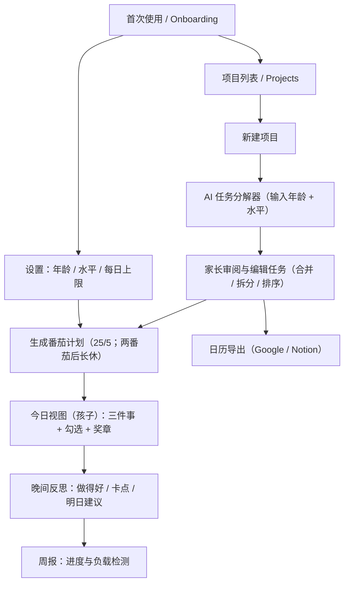

# AI 亲子计划助手 · 无代码 MVP

> 目标：用 **无代码 + AI** 做一个演示级产品，让家长输入“项目”，AI 自动**拆解任务**并生成**番茄时间表**，可在手机上运行（Glide/Notion），并在 GitHub Pages 上展示结果。

- 🧑‍🎓 目标用户：家长
- 🌟 核心卖点：**AI 自动拆任务**（贴合年龄/水平），**一键生成番茄计划**
- 📱 形态：手机网页（PWA/Glide） + GitHub Pages 展示
- 📅 更新日期：2025-08-12

## 项目结构
```
ai-planner-starter/
├─ README.md
├─ LICENSE
├─ docs/
│  ├─ index.md                # GitHub Pages 首页（包含流程图）
│  ├─ prompts.md              # AI 提示词模板
│  ├─ no-code-setup.md        # 无代码搭建步骤（Glide + Make）
│  ├─ structure.md            # 数据结构（JSON 模型）
│  └─ user-stories.md         # 用户故事 & 验收标准
└─ assets/
```

## 快速开始（展示在 GitHub Pages）
1. 把这个仓库上传到 GitHub（建议仓库名：`ai-planner-starter`）。
2. 打开 **Settings → Pages**：
   - Source 选择 **GitHub Actions** 或 **Deploy from a branch**，分支选 `main`，目录选 `/docs`。
3. 打开 Pages 提供的网址，即可看到首页（含流程图）。

想要实际可用的无代码 App，请看 **[docs/no-code-setup.md](docs/no-code-setup.md)**。

---

## 页面流程图（Mermaid）
> 完整版在 **docs/index.md**，这里给一个简版预览。


---

## 许可
本项目采用 **MIT License**，详见 `LICENSE`。
